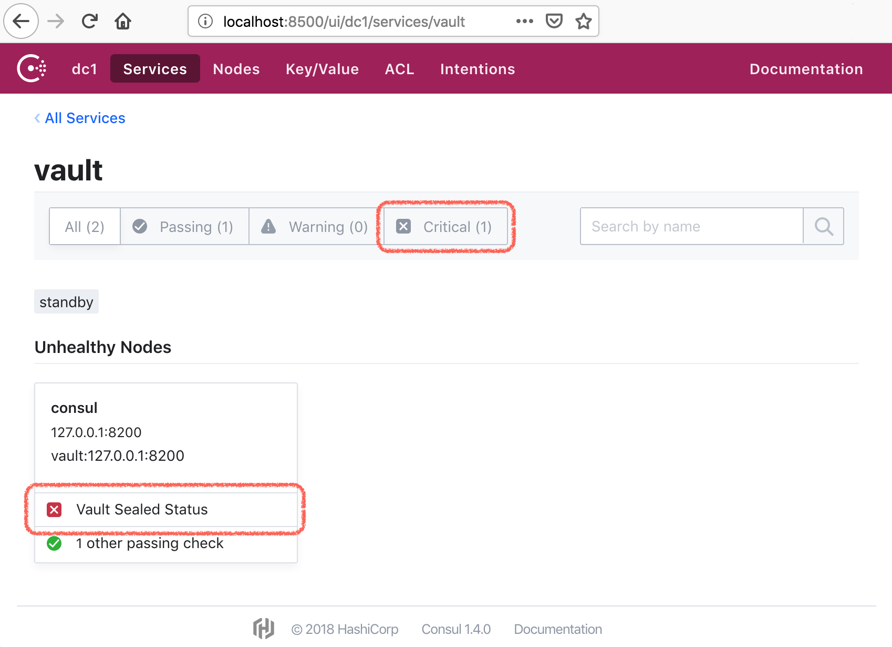
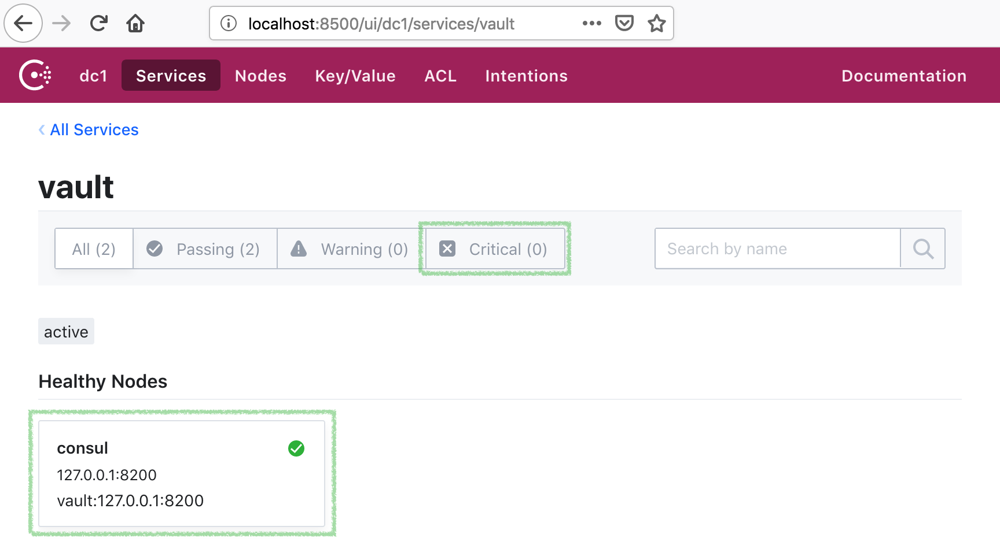
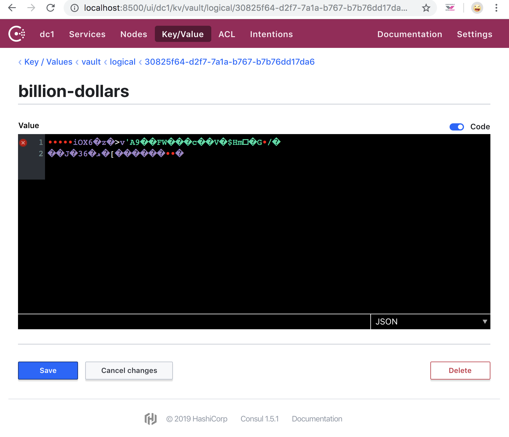

# Containerized Consul and Vault

Consul and Vault are started together in two separate, but linked, docker containers.

Vault is configured to use a `consul` [secret backend](https://www.vaultproject.io/docs/secrets/consul/).

---

- [Start Consul and Vault](#start-consul-and-vault)
- [Getting Vault Ready](#getting-vault-ready)
  - [Init Vault](#init-vault)
  - [Unsealing Vault](#unsealing-vault)
  - [Auth with Vault](#auth-with-vault)
- [Making sure it actually works](#making-sure-it-actually-works)
  - [Watch Consul logs](#watch-consul-logs)
  - [Writing / Reading Secrets](#writing--reading-secrets)
  - [Response Wrapping](#response-wrapping)
    - [System Backend](#system-backend)
    - [Cubbyhole Backend](#cubbyhole-backend)
- [Troubleshooting](#troubleshooting)
  - [Bad Image Caches](bad-image-caches)
- [License](#license)


## Start Consul and Vault

```bash
docker-compose up -d
```


## Getting Vault Ready

Login to the Vault image:

```bash
docker exec -it docker-nontrivial_vault_1 sh
```

Check Vault's status:

```bash
/ # vault status
Key                Value
---                -----
Seal Type          shamir
Initialized        false
Sealed             true
Total Shares       0
Threshold          0
Unseal Progress    0/0
Unseal Nonce       n/a
Version            n/a
HA Enabled         true
```

At this point you should be able to navigate to the [Consul User Interface](http://localhost:8500/ui/dc1/services) locally. Since Vault is not yet initialized (`Initialized  false`), it is sealed (`Sealed  true`), this is why Consul will will be seeing a sealed critial status:

<p align="center"></p>


### Init Vault

```bash
/ # vault operator init
Unseal Key 1: L9R3T5C+2aUg4x6+9Rayog2GDH9vojxnsEvvBlfJVRzC
Unseal Key 2: KWRcMcVp0Gk9YhLe1ZMPikOhGXMgFwAPuEehWNI+kPem
Unseal Key 3: waJEyjyl+UBKYXIhTspUIa5SwSHNakRkgscGata+w83X
Unseal Key 4: YGStlq+r29bqTTN760AZC7h+uv21N9L1ZX9bsSJF/46e
Unseal Key 5: 5yl4ptnngRdKwVP0rEZYs4uprVrN9XZij3pTOEhrsf3D

Initial Root Token: s.1NMmSns6nyynXleio6SxqkGm

Vault initialized with 5 key shares and a key threshold of 3. Please securely
distribute the key shares printed above. When the Vault is re-sealed,
restarted, or stopped, you must supply at least 3 of these keys to unseal it
before it can start servicing requests.

Vault does not store the generated master key. Without at least 3 key to
reconstruct the master key, Vault will remain permanently sealed!

It is possible to generate new unseal keys, provided you have a quorum of
existing unseal keys shares. See "vault operator rekey" for more information.
```

notice Vault says:

> you must provide at least 3 of these keys to unseal it again

hence it needs to be unsealed 3 times with 3 different keys (out of the 5 above)


### Unsealing Vault

```bash
/ # vault operator unseal
Unseal Key (will be hidden):
Key                Value
---                -----
...
Sealed             true
Unseal Progress    1/3

$ vault operator unseal
Unseal Key (will be hidden):
Key                Value
---                -----
...
Sealed             true
Unseal Progress    2/3

$ vault operator unseal
Unseal Key (will be hidden):
Key                    Value
---                    -----
...
Initialized            true
Sealed                 false
...
Active Node Address    <none>
```

the Vault is now unsealed:

<p align="center"></p>


### Auth with Vault

We can use the `Initial Root Token` from above to auth with the Vault:

```bash
/ # vault login
Token (will be hidden):
Success! You are now authenticated. The token information displayed below
is already stored in the token helper. You do NOT need to run "vault login"
again. Future Vault requests will automatically use this token.

Key                  Value
---                  -----
token                s.2uyJcIXm7n06jYc6bVXyXdgr
token_accessor       CAp35nVt29tcLh1rbWK7Sm3H
token_duration       ∞
token_renewable      false
token_policies       ["root"]
identity_policies    []
policies             ["root"]
```

---

All done: now you have both Consul and Vault running side by side.


## Making sure it actually works

From the host environment (i.e. outside of the docker image):

```bash
alias local-vault='docker exec -it docker-nontrivial_vault_1 vault "$@"'
```

This will allow to run `local-vault` commands without a need to login to the image.

> the reason commands will work is because you just `auth`'ed (logged into Vault) with a root token inside the image in the previous step.


### Watch Consul logs

In one terminal tail Consul logs:

```bash
$ docker logs docker-nontrivial_consul_1 -f
```


### Writing / Reading Secrets

In order to create the secret handler to which we will be writing, it will need to be enabled using the following:

```bash
/ # vault secrets enable -path=secret -description='as per example' kv
Success! Enabled the kv secrets engine at: secret/
```

You can then confirm it your path was created by running the following:

```bash
/ # vault secrets list
Path          Type         Accessor              Description
----          ----         --------              -----------
cubbyhole/    cubbyhole    cubbyhole_b5c25a35    per-token private secret storage
identity/     identity     identity_4be39347     identity store
kv/           kv           kv_c2a74a0a           n/a
secret/       kv           kv_e06e0793           as per example
sys/          system       system_ac6828ba       system endpoints used for control, policy and debugging
```

In the other terminal run vault commands:

```bash
/ # vault write -address=http://127.0.0.1:8200 secret/billion-dollars value=secret-squirrel

Success! Data written to: secret/billion-dollars
```

Check the Consul log, you should see something like:

```bash
2016/12/28 06:52:09 [DEBUG] http: Request PUT /v1/kv/vault/logical/30825f64-d2f7-7a1a-b767-b7b76dd17da6/billion-dollars (697.3µs) from=172.19.0.3:35096
```

Let's read it back:

```bash
/ # vault read secret/billion-dollars
Key             	Value
---             	-----
refresh_interval	768h
value           	secret-squirrel
```

And it is in fact in Consul:

<p align="center"></p>

### Response Wrapping

> _NOTE: for these examples to work you would need [jq](https://stedolan.github.io/jq/) (i.e. to parse JSON responses from Vault)._

> _`brew install jq` or `apt-get install jq` or similar_

#### System backend

Running with a [System Secret Backend](https://www.vaultproject.io/api/system/index.html).

Export Vault env vars for the local scripts to work:

```bash
$ export VAULT_ADDR=http://127.0.0.1:8200
$ export VAULT_TOKEN=s.1NMmSns6nyynXleio6SxqkGm  ### root token you remembered from initializing Vault
```

At the root of `docker-nontrivial` project there is `creds.json` file (you can create your own of course):

```bash
$ cat creds.json

{
  "username": "Gabelbombe",
  "password": "secret-squirrel"
}
```

We can write it to a "one time place" in Vault. This one time place will be accessible by a "one time token" Vault will return from a
`/sys/wrapping/wrap` endpoint:

```bash
$ token=`./tools/vault/wrap-token.sh creds.json`

$ echo $token
s.QMg6V33UHRNZR4DKMH4f8ijl
```

You can checkout [wrap-token.sh](tools/vault/wrap-token.sh) script, it uses `/sys/wrapping/wrap` Vault's endpoint
to secretly persist `creds.json` and return a token for it that will be valid for 60 seconds.

Now let's use this token to unwrap the secret:

```bash
$ ./tools/vault/unwrap-token.sh $token

{
  "username": "Gabelbombe",
  "password": "secret-squirrel"
}
```

You can checkout [unwrap-token.sh](tools/vault/unwrap-token.sh) script, it uses `/sys/wrapping/unwrap` Vault's endpoint

Let's try to use the same token again:

```bash
$ ./tools/vault/unwrap-token.sh $token
["wrapping token is not valid or does not exist"]
```

i.e. Vault takes `one time` pretty seriously.

#### Cubbyhole backend

Running with a [Cubbyhole Secret Backend](https://www.vaultproject.io/docs/secrets/cubbyhole/index.html).

Export Vault env vars for the local scripts to work:

```bash
$ export VAULT_ADDR=http://127.0.0.1:8200
$ export VAULT_TOKEN==s.1NMmSns6nyynXleio6SxqkGm  ### root token you remembered from initializing Vault
```

Create a cubbyhole for the `billion-dollars` secret, and wrap it in a one time use token:

```bash
$ token=`./tools/vault/cubbyhole-token-wrapper.sh /secret/billion-dollars`
```

let's look at it:

```bash
$ echo $token
s.BQK9xRYUDnHsgJ7quUBWzUuZ
```

looks like any other token, but it is in fact a _one time use_ token, only for this cobbyhole.

Let's use it:

```bash
$ curl -s -H "X-Vault-Token: $token" -X GET $VAULT_ADDR/v1/cubbyhole/response
```
```json
{"lease_id": "",
 "renewable": false,
 "lease_duration": 0,
 "data": {
   "response": {
     "lease_id": "",
     "renewable": false,
     "lease_duration": 2592000,
     "data": {
       "value": "secret-squirrel"
     },
     "wrap_info": null,
     "warnings": null,
     "auth": null
   }
 },
 "wrap_info": null,
 "warnings": null,
 "auth": null}
```

Let's try to use it again:

```bash
$ curl -s -H "X-Vault-Token: $token" -X GET $VAULT_ADDR/v1/cubbyhole/response
```
```json
{"errors":["permission denied"]}
```

Vault takes `one time` pretty seriously.


## Troubleshooting

### Bad Image Caches

In case there are some stale / stopped cached images, you might get connection exceptions:

```clojure
failed to check for initialization: Get v1/kv/vault/core/keyring: dial tcp i/o timeout

reconcile unable to talk with Consul backend: error=service registration failed: /v1/agent/service/register
```

You can purge stopped images to solve that:

```bash
docker rm $(docker ps -a -q)
```
